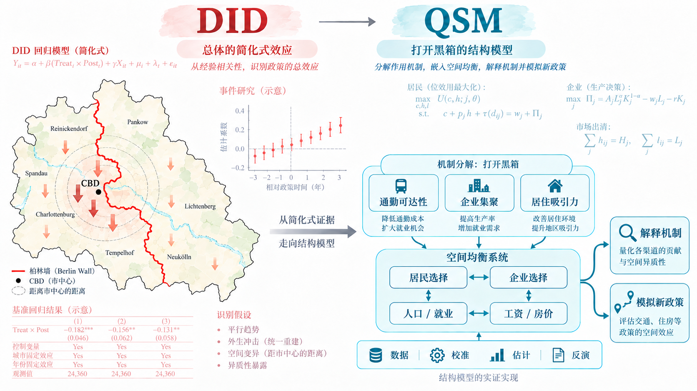
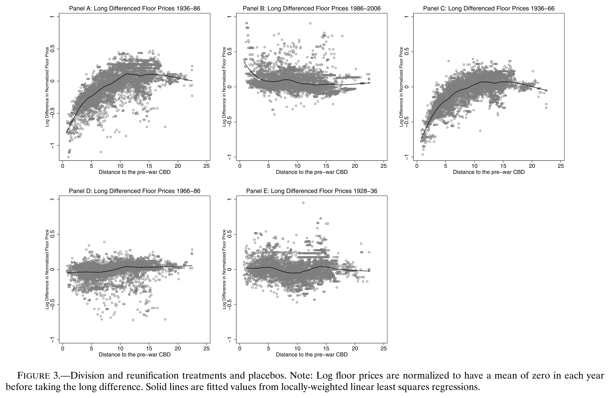

> **作者：** 茅靓化 (连享会)    
> **邮箱：** <lianxhcn@163.com> 

&emsp; 

- **Title**: 从 DID 到 QSM：柏林墙研究如何连接因果识别与空间均衡
- **Keywords**: 定量空间模型, Quantitative Spatial Model, 机制分析, Ahlfeldt, 柏林墙, 政策冲击, 空间均衡模型, 两德统一

>**提要**：本文讨论了在完成 DID 分析之后，如何利用 QSM（定量空间模型）进一步推进机制分析。通过柏林墙的历史案例，说明了单纯的处理效应无法揭示复杂的经济机制，而 QSM 可以通过明确经济主体的决策行为及其相互作用，揭示政策冲击背后的深层次机制。

> 点击查看：[QSM 系列推文](https://www.lianxh.cn/search.html?s=QSM)

---

## 0. 导言：DID 只能看个大概

拿到一个有意思的政策冲击以后，我们通常很快会形成一套熟悉的实证分析路径：先做基准 DID，再画事件研究图，随后更换估计量、样本区间和控制变量做稳健性检验；如果结果比较稳定，再考察国企与民企、不同地区、不同规模企业之间的异质性；到了机制部分，则寻找融资约束、投资、创新、劳动力流动等中间变量，希望进一步解释处理效应为什么会出现。

做到这里，一篇政策评价论文往往已经相当完整。问题在于，研究目标如果继续往前推进，原来的工具可能就不够用了。比如交通改善以后企业进入增加，既可能是因为工人通勤更方便，也可能是因为企业集聚提高了生产率，还可能是人口流入扩大了本地市场。这几种机制可以同时存在，而且会彼此影响。我们当然可以逐项考察工资、就业、人口或者投资是否发生变化，这些结果能够提供机制线索；但如果进一步追问每条机制分别有多重要、它们怎样相互反馈，以及为什么这些作用合在一起恰好产生了当前观察到的处理效应，单靠增加几组中间变量就很难把整个故事讲完整。

这里并不存在「DID 好不好」的问题。工具本身是中性的，关键取决于研究者希望把问题看到什么程度。如果目标只是识别一项政策平均产生了多大影响，DID、IV、RDD 往往已经非常合适；如果还希望研究企业和居民怎样调整、工资和价格怎样反馈、影响如何传导到其他地区，以及整个系统最后停在什么位置，就需要换一套分辨率更高的工具。就像观察同一个对象，普通镜头足以看清轮廓；如果想进一步观察内部结构，就需要更高倍率的设备。

Ahlfeldt et al. ([2015](https://doi.org/10.3982/ECTA10876)) 的 *The Economics of Density: Evidence from the Berlin Wall* 很适合说明这种转变。这篇论文前半部分采用的是许多实证研究者非常熟悉的分析思路：利用柏林分裂与统一造成的外生空间冲击，估计不同地区的地价、人口和就业发生了什么变化。真正拉开研究深度的，是作者没有把这些结果当成终点，而是继续把居民、企业、土地市场、通勤和集聚外部性放入一个空间均衡模型，进一步回答「为什么会发生这些变化」以及「如果换一种政策环境会怎样」。

整篇论文的研究路径可以概括为：

$$
\text{What happened?}
\rightarrow
\text{Why?}
\rightarrow
\text{What if?}
$$

下面这幅图，是理解这篇论文最简单的入口。

左边是熟悉的简约式 (reduced-form) 世界：政策冲击、处理效应、事件研究和回归表。右边多出来的是主体行为、价格调整、市场清算、参数量化以及反事实。QSM 并没有取消左边的工作，而是从左边继续往前走。

QSM 到底是什么？

<strong>定量空间模型</strong> (Quantitative Spatial Models, QSM) 是一类面向数据的空间均衡模型。它把城市、地区或国家看成彼此连接的经济单元，把居民、企业等经济主体的区位选择，以及工资、价格、人口、就业等变量放进同一个均衡系统，再利用实际数据对模型进行量化。

一项 QSM 分析通常包含几个基本环节：

▸
<strong>地点与联系：</strong>确定哪些地区相互连接，以及通勤时间、贸易成本、迁移成本等空间摩擦。

▸
<strong>主体选择：</strong>明确居民在哪里居住和工作、企业在哪里生产，以及这些选择怎样受到工资、价格和空间摩擦影响。

▸
<strong>市场均衡：</strong>要求居民和企业的选择与劳动力、住房、土地或商品市场同时相容，工资、价格、人口和就业共同调整。

▸
<strong>模型量化：</strong>利用数据、文献校准、参数估计和模型反演，把理论模型中的关键参数和不可直接观察的经济变量量化出来。

▸
<strong>政策反事实：</strong>改变交通网络、税率、贸易成本或其他政策条件，重新求解均衡，分析经济活动怎样重新配置以及福利如何变化。

因此，QSM 关注的不只是「某个地区受到冲击以后结果变量变了多少」，而是<strong>经济主体为什么这样调整、这些调整怎样通过相互联系传导，以及整个系统最终会形成什么新的均衡</strong>。

---

## 1. 柏林墙：DID 看到了什么？

下面，我们以 QSM 领域的经典案例——柏林墙的分裂与统一——为例，说明 DID 之后如何继续往前。

> - Ahlfeldt, G. M., Redding, S. J., Sturm, D. M., & Wolf, N. (2015). The economics of density: Evidence from the Berlin Wall. *Econometrica, 83*(6), 2127–2189. [Link](https://doi.org/10.3982/ECTA10876), [PDF](https://www.princeton.edu/~reddings/pubpapers/Berlin-Ecta-10876.pdf), [Google](https://scholar.google.com/scholar?q=The+Economics+of+Density+Evidence+from+the+Berlin+Wall).

二战以前，柏林主要的商业中心位于 Mitte。战后柏林被划入两个不同的经济体系，传统 CBD 落入东柏林，一批原本紧邻城市中心的西柏林街区突然失去了与这一高密度经济中心之间的联系。1961 年柏林墙建成以后，这种分割被进一步强化；1989 年柏林墙倒塌、1990 年德国统一以后，东西柏林之间的联系又重新恢复。

这个历史过程提供了一个非常少见的空间实验：

$$
\text{integration}
\rightarrow
\text{division}
\rightarrow
\text{reintegration}.
$$

关键在于，那些西柏林街区并没有改变自己的地理位置，很多历史建筑和自然条件也没有因为政治分割突然变化。真正发生巨大变化的，是它们能够接触到的企业、工人和就业机会。因此，作者可以利用街区在战前相对于传统 CBD 的位置，构造不同程度的空间暴露。

从今天 DID 文献的术语看，Ahlfeldt et al. (2015) 的这一部分更接近「长期差分 + 空间异质暴露」，而不是标准的两组两期 DID，但实证研究者对它的基本逻辑并不会陌生。

1936–1986 年间，距战前 CBD 最近的一组西柏林街区，相对于较远地区，建筑面积价格变化的估计系数约为：

$$
\widehat{\beta}_{1}=-0.800.
$$

换算以后，大约对应 55% 的相对下降。统一以后，方向发生反转。1986–2006 年最近一组的估计约为：

$$
\widehat{\beta}_{1}=0.398,
$$

大致对应 49% 的相对上涨。

原文 Figure 3 把这种空间梯度画得很清楚：分裂以后，越靠近战前 CBD 的西柏林地区下降越明显；统一以后，这一梯度又反向变化，同时作者还利用更早时期的数据检查事前趋势和冲击发生的时间。

到这里，一篇通常意义上的政策评价论文已经可以做得相当完整。我们可以继续更换距离区间、加入控制变量、做 placebo、换样本，还可以研究就业和人口是否出现类似结果。

Ahlfeldt et al. (2015) 真正值得学习的地方，是作者把这组结果只当作 baseline。因为 $-0.800$ 告诉我们的只是：柏林分裂产生了很大的经济影响。它还没有告诉我们，这个影响究竟是怎样形成的。

## 2. 一个处理效应为什么还不够？

柏林分裂以后，靠近原 CBD 的西柏林地区至少同时经历了三类变化。

- 第一类是**通勤可达性**。居民原来可以方便地前往传统中心工作，分裂以后部分就业机会突然变得不可达，一个地区作为居住地的价值自然会下降。
- 第二类是**生产集聚**。企业原本可以接触到大量其他企业和劳动者，从知识溢出、专业化投入和劳动力匹配中获益；周边就业密度下降以后，当地生产率也可能随之下降。
- 第三类是**居住吸引力**。人口减少以后，商店、餐厅和各种生活服务可能同时减少；反过来，人口高度集中的地区又可能因为消费服务丰富而更适合居住。

问题在于，这三条机制不是三条互不相关的通道。企业减少会改变就业和工资，工资和就业变化会影响居民迁移，人口变化又会改变房价和本地服务，而这些变化还会继续影响企业和居民下一轮的区位选择。

因此，一个观察到的处理效应背后可能存在如下反馈：

$$
\text{employment}
\rightarrow
\text{productivity}
\rightarrow
\text{firms}
\rightarrow
\text{employment},
$$

同时还存在：

$$
\text{population}
\rightarrow
\text{amenity}
\rightarrow
\text{residents}
\rightarrow
\text{population}.
$$

这时候，逐项考察中间变量当然仍有价值，但研究目标已经发生变化：我们不再只是想证明某个变量也发生了变化，而是希望说明不同经济主体怎样共同作出选择，这些选择如何影响价格和数量，以及整个系统怎样同时满足市场约束。

换句话说，研究问题已经从「有没有效」推进到：

> **什么样的经济机制，能够共同生成我们实际观察到的人口、就业、通勤和地价变化？**

这就是结构模型开始有用的地方。

## 3. QSM 如何把机制写进模型？

第一次看到这类论文时，最容易产生的误解，是把大量公式都归入「理论部分」。其实在 QSM 中，这些公式主要承担一个非常实证化的任务：明确谁在做决定、依据什么做决定，以及这些决定怎样连接起来。

Ahlfeldt et al. (2015) 的模型中有三类主要经济主体。居民同时选择在哪里居住、在哪里工作，并在一般消费和住宅面积之间分配收入；企业选择在哪里生产，并决定使用多少劳动和商业建筑面积；开发商利用土地和资本供给住宅和商业建筑面积。不同地点通过通勤网络相互连接，周边就业密度还会影响生产率，周边人口密度则会影响居住便利度。

最终，模型必须同时满足几类均衡条件：

- 劳动力市场要清算，一个地区吸引到的工人数量要与企业需要的就业量相容；
- 住宅和商业建筑面积市场要清算；
- 企业要满足利润最大化和零利润条件；
- 居民对居住地和工作地的选择，要与工资、房价和通勤成本相容。

这才是模型的完整骨架。

居民一侧最重要的选择是：

$$
\text{residence }i
+
\text{workplace }j.
$$

一个工作地点工资越高，对居民越有吸引力；但通勤时间越长，这种吸引力越弱。高度简化以后，住在 $i$ 的居民选择到 $j$ 工作的概率可以理解为：

$$
\pi_{ij|i}
\propto
w_{j}^{\varepsilon}
e^{-\nu\tau_{ij}}.
$$

企业面对的是另一组权衡。一个地方生产率越高，企业越愿意在那里支付工资和商业地价；但工资、土地和建筑成本越高，又越会抑制企业继续进入。开发商则连接了企业和居民的区位需求：一个地方越受欢迎，建筑面积价格越高，土地稀缺由此成为限制无限集聚的一种力量。

真正让这篇文章成为「密度经济」研究的，是作者进一步把一个地区的生产率写成：

$$
A_{i}
=
a_{i}
\left[
\sum_{j}
e^{-\delta\tau_{ij}}
\frac{H^{M}_{j}}{K_{j}}
\right]^{\lambda}.
$$

这个公式不需要一开始就逐项推导。最重要的是，它把两个概念明确分开了：

$$
\text{productivity}
=
\text{local fundamentals}
\times
\text{agglomeration}.
$$

$a_{i}$ 表示这个地区本身的生产基本面，括号里的部分则表示它能够接触到的周边就业密度。一个地方今天企业很多，可能是因为这个地方天然条件好，也可能因为周围已经聚集了大量企业，使这里进一步获得了集聚收益。

居民一侧有完全对应的设定：周边居民越多，本地商店、餐厅和服务可能越丰富，居住便利度也会发生变化。

于是，原本散落在不同机制回归里的经济关系，被放进了同一个系统：

$$
H
\rightarrow
A,B
\rightarrow
w,Q
\rightarrow
\text{location choice}
\rightarrow
H.
$$

这就是 QSM 与普通机制回归最根本的区别之一。它不是多找几个中间变量，而是要求这些中间变量和主体行为共同构成一个能够闭合的经济系统。

我自己以前读实证论文时也有一个很典型的习惯。看到 DID、IV、事件研究和稳健性检验，通常会认真往下读；一旦后面突然出现效用函数、利润最大化和一大串均衡条件，我很容易把它归到「理论部分」，很快翻过去。一方面觉得这些公式离自己的实证研究比较远，另一方面也确实有些畏难：即使耐心把模型读懂了，也不知道怎样把它变成自己的数据、参数和代码。

后来接触 QSM 以后我才逐渐意识到，这中间其实不是一道墙，而是几级台阶。主体怎样决策、参数从哪里来、哪些变量可以直接观察、哪些可以通过均衡条件反推、模型估计以后怎样重新求解反事实，这些问题都可以逐项拆开。

## 4. 结构模型怎样和数据连接？

结构模型看起来复杂，一个重要原因是公式里出现了大量现实数据中看不到的变量。比如我们并没有一张现成的数据表，告诉我们每个柏林街区的真实生产率 $A_{i}$ 或居住便利度 $B_{i}$。

Ahlfeldt et al. (2015) 的处理方式很有启发性：**不一定要直接观察这些变量，可以利用观察到的均衡结果把它们反推出来。**

研究者真正拥有的是人口、就业、地价、土地和通勤时间。模型则告诉我们，这些变量在均衡中应该满足怎样的关系。因此可以反过来问：什么样的工资、生产率和居住便利度，才能让模型生成现实中看到的人口、就业、房价和通勤？

这就是**模型反演(model inversion)**。

例如，一个地方工资很高，商业建筑面积也很贵，但企业仍然愿意在那里生产，那么在利润最大化和零利润条件下，这个地方必须具有足够高的生产率。类似地，如果一个地区住房价格很高、通勤条件并不突出，却仍然吸引大量居民，那么模型就需要较高的居住便利度才能解释这种观察结果。

于是有：

$$
\boxed{
\text{Observed equilibrium}
\rightarrow
\text{latent economic objects}
}
$$

从这个角度看，结构模型本身也是一种测量工具。

这里还有一个很容易消除误解的地方：QSM 并不意味着「模型里有多少参数，就要自己重新估多少参数」。实际研究通常会把模型中的对象分成几类。

| 对象                             | 主要来源           |
| -------------------------------- | ------------------ |
| 人口、就业、地价、土地、通勤时间 | 直接数据           |
| 住房支出份额、生产成本份额       | 既有文献校准       |
| 通勤对时间的敏感程度             | 微观通勤数据估计   |
| 工资、生产率、居住便利度         | 模型反演           |
| 集聚效应的强度和空间范围         | 柏林自然实验 + GMM |

因此，QSM 的量化过程其实可以拆成几个很明确的步骤：

$$
\text{Data}
\rightarrow
\text{Calibration}
\rightarrow
\text{Estimation}
\rightarrow
\text{Inversion}.
$$

真正关系到论文核心问题的参数，才需要重点识别。

这一点对习惯了简约式研究的人非常重要。第一次看到几十个方程，容易觉得结构估计是一个巨大的整体；真正动手以后才会发现，不同参数有不同来源，很多任务并不需要从零开始。

## 5. 柏林墙如何识别关键参数？

结构模型建立以后，柏林墙这个自然实验没有被丢掉。相反，它开始承担一个更重要的任务：帮助作者识别模型里最关键的集聚参数。

假设某个地点的生产率为：

$$
A_{i}
=
a_{i}\Upsilon_{i}^{\lambda},
$$

其中 $a_{i}$ 是当地自身的生产基本面，$\Upsilon_{i}$ 是周边可达就业密度，$\lambda$ 则表示集聚效应有多强。

从横截面看，很难知道一个地区生产率高究竟是因为 $a_{i}$ 高，还是因为 $\Upsilon_{i}$ 高。柏林分裂恰好提供了一个特殊的变化：靠近传统 CBD 的西柏林地区突然失去了大量周边经济活动，但这些街区本身的位置并没有发生变化。

如果 $\lambda$ 设得太小，那么模型就无法用「失去周边集聚」解释这些地区生产率的下降，只能认为它们自身的生产基本面恰好在柏林分裂时一起恶化；如果 $\lambda$ 设得合适，大量观察到的变化就可以由周边就业密度下降来解释。

因此，自然实验和结构模型在这里不是相互替代的关系。**自然实验负责提供可信的外生变化，结构模型负责利用这些变化识别具有经济含义的参数。**

作者最终得到的生产集聚弹性大约为：

$$
\widehat{\lambda}=0.071.
$$

也就是说，周边可达就业密度提高 10%，当地生产率大约提高 0.7%。

更有意思的是，这种效应很 local。随着通勤时间增加，集聚效应迅速衰减；大约超过 10 分钟的通勤距离以后，论文估计的生产和居住外部性已经很弱。

因此，真正重要的不是「这个城市一共有多少企业」，而是**有多少企业和人口处在你真正能够接触到的范围之内**。

这也解释了为什么一条地铁、一座桥或者一项交通限制，可以改变一座城市内部的经济地理。

## 6. 从历史冲击到政策反事实？

到这一步，研究问题已经从历史解释进一步推进到政策设计。

简约式分析通常从一个真实发生过的政策冲击出发，回答「这个政策产生了什么影响」。结构模型在解释这些历史事实以后，还能够改变模型中的某个外生条件，重新计算居民、企业、工资、房价、人口和就业怎样一起调整。

Ahlfeldt et al. (2015) 最后做了一个很直观的反事实：

> 如果 2006 年的柏林没有私人汽车，只能依靠公共交通，会发生什么？

作者不是把某个通勤回归系数简单乘以交通时间变化，而是先重新构造整个城市的通勤时间矩阵：

$$
\tau_{ij}
\rightarrow
\tau_{ij}^{CF}.
$$

新的交通条件改变居民在哪里住、在哪里工作；人口和就业重新分布以后，又会改变生产率和居住便利度；工资和房价随之调整，居民和企业进一步重新选择，一直到整个系统达到新的均衡。

因此，反事实重新求解的是一整组内生结果：

$$
\{
w^{CF},
Q^{CF},
H^{R,CF},
H^{M,CF},
A^{CF},
B^{CF}
\}.
$$

论文得到的结果是：在这一反事实中，柏林总就业大约下降 14%，产出下降约 12%，平均建筑面积价格下降约 20%。

这里真正值得关注的不是这三个数字，而是研究问题已经改变了。从「已经发生的政策造成了什么影响」，走到了「如果采用一种历史中从未出现过的政策设计，整个经济系统会怎样重新调整」。

当研究目标走到这里，简约式处理效应并没有失效，只是它已经不能独立完成全部任务。研究者需要一个能够同时描述行为、价格和市场反馈的结构。

## 7. 我如何开始学习 QSM？

到这里，QSM 的基本思想其实并不难理解。熟悉实证研究的读者甚至很容易产生一种感觉：无非是把居民和企业的选择写清楚，再加上几个市场清算条件，好像也没有那么复杂。

当然，看懂一张框架图和真正把模型跑起来，是两回事。真正开始做 QSM 时，至少需要补上几类知识：

- **离散选择与随机效用。** 理解为什么个体选择可以汇总成通勤、迁移或贸易流。
- **空间均衡。** 理解工资、价格、人口和企业位置为什么必须同时满足市场清算。
- **模型量化。** 分清哪些参数来自数据、哪些来自文献校准、哪些需要估计，以及模型反演究竟在做什么。
- **数值求解与反事实。** 把均衡条件写成可以求解的方程组，并在改变政策以后重新寻找新的均衡。

这些内容并没有超出正常的经济学训练范围，但如果过去长期只读简约式实证论文，很可能从来没有系统接触过。

如果准备进一步进入 QSM，可以从几类材料开始：

- Redding and Rossi-Hansberg ([2017](https://doi.org/10.1146/annurev-economics-063016-103713)) 的综述 *Quantitative Spatial Economics* 是这一领域最经典的入口之一，系统整理了 QSM 的主要组成部分、量化方法和反事实分析。
- Redding ([2023](https://doi.org/10.1257/jep.37.2.75)) 的 *Quantitative Urban Models: From Theory to Data* 篇幅更短，也更适合第一次进入这个领域的读者。

如果希望真正看代码，Ahlfeldt 的 Quantitative Spatial Economics 课程材料更直接。他把 Ahlfeldt et al. (2015) 拆成 **Model、Quantification、Counterfactuals** 三讲，并配有专门的 [ARSW2015 Toolkit](https://github.com/Ahlfeldt/ARSW2015-toolkit)。这个教学工具包没有试图完整复制论文的所有程序，而是抽取量化、模型反演和反事实求解的核心代码，并专门降低了部分数据和计算要求。

到这里，大家应该能感觉到：QSM 的门槛确实比跑一组 DID 高，但这些门槛是可以拆开的。真正需要系统补上的，是一套过去可能没有进入自己工具箱的知识，而不是突然转行去做纯理论经济学。

## 8. 这套框架还能用到哪里？

如果只看 Berlin Wall，很容易把 QSM 理解成一种专门研究城市、交通和人口迁移的方法。事实上，它是一种处理相互关联经济单元的通用框架，适用于城市、企业和金融等多种情境。

严格地说，QSM 仍然以地点、空间摩擦和跨地点联系为核心，不能把任何网络模型都称为 QSM。但这套框架真正值得迁移的，是它处理**相互关联经济单元**的方法：

$$
\boxed{
\text{nodes}
+
\text{frictions}
+
\text{flows}
+
\text{choices}
+
\text{market clearing}
+
\text{counterfactual}
}
$$

在 Berlin Wall 中，节点是城市街区，连接它们的是通勤时间；换一个研究问题以后，节点可以变成州、工厂、银行和地区，连接方式也可以从地理距离扩展为企业内部网络、资金流或其他经济联系。

过去十年的一批研究，已经把这套思路推进到了财政、企业和金融等领域。

**A. 财政领域**

Fajgelbaum et al. ([2019](https://doi.org/10.1093/restud/rdy050)) 研究美国州税差异。问题表面上是财政政策：不同州的企业税和个人所得税怎样影响经济活动。作者建立空间一般均衡模型，让企业和工人对不同州的税制做出区位调整，从而进一步研究税制差异造成的空间错配以及税制改革的福利后果。
  
如果只做简约式研究，我们可以问：某州降税以后，就业或企业进入增加了多少？结构模型则可以继续问：企业从哪里迁来，工人怎样跟着调整，其他州的税基发生了什么变化，所有地区一起调整以后，另一套税制的总体福利又会怎样变化。

**B. 企业生产率**

到了公司层面，Giroud et al. ([2024](https://doi.org/10.3982/ECTA20029)) 的 *Econometrica* 论文提供了一个特别有意思的例子。他们发现，大型工厂开业不仅提高附近工厂的生产率，还会通过多地区企业内部的知识共享网络，提高同一家企业数百英里之外其他工厂的生产率。为了量化这种传播，作者建立了一个 quantitative spatial model，把不同地区的工厂通过企业内部网络连接起来。

这个例子表明，**经济距离不一定只等于地理距离**。两个工厂相隔很远，但如果属于同一家企业，并通过组织内部持续共享知识，它们之间的有效联系可能比两个地理上更近、彼此毫无关系的工厂更强。

**C. 金融领域**

目前，QSM 在金融领域的应用也在逐渐增多，主要集中在研究银行、资金流动和金融网络如何影响区域经济和金融稳定。

Aguirregabiria, Clark and Wang ([2025](https://doi.org/10.1257/aer.20200374)) 在 *American Economic Review* 研究银行资金怎样在不同地区之间流动。他们把不同地区的存款市场、贷款市场和银行网点网络连接起来，建立银行竞争的结构模型，再分析网点网络、范围经济和本地竞争怎样影响资金流向信贷需求较高但资金不足的地区。

研究对象已经从：

$$
\text{workers}
\rightarrow
\text{firms}
\rightarrow
\text{locations}
$$

变成：

$$
\text{depositors}
\rightarrow
\text{banks}
\rightarrow
\text{borrowers}
\rightarrow
\text{regions}.
$$

但方法上的核心问题十分相似：一个地区或一家银行受到冲击以后，这个冲击怎样沿着相互连接的市场传播，其他地区怎样调整，最后整个系统停在哪里？

Maingi ([2026](https://doi.org/10.1016/j.jfineco.2025.104226)) 发表于 *Journal of Financial Economics* 的论文进一步把 QSM 用到 2023 年美国区域银行危机，在模型中加入银行的空间贷款网络，研究银行资金冲击怎样通过存款重新配置和贷款机会影响不同地区的实体经济。

从 Berlin 的城市街区，到州税，再到多地区企业内部网络和银行贷款网络，研究对象看起来已经相距很远，但背后的工作流非常相似：

$$
\text{who chooses}
\rightarrow
\text{how units are connected}
\rightarrow
\text{market clearing}
\rightarrow
\text{quantification}
\rightarrow
\text{new equilibrium}.
$$

## 9. 结语

当研究对象之间存在真实的相互联系，一个局部冲击会改变其他主体的选择环境，而研究问题又不仅停留在「有没有效」，QSM 所代表的这套分析框架就可能变得有价值。

对已经熟悉 DID、IV、RDD 和 SCM 的研究者而言，下一步真正拉开论文分析深度的，未必是再更换一种估计量，或者再增加一组异质性回归，而是能不能根据研究目标选择更合适的分析框架和工具：需要看局部处理效应时，用局部工具；需要解释主体行为、市场反馈和全局均衡时，就把结构部分补上。

Ahlfeldt et al. (2015) 最值得学习的地方就在这里。作者没有停留在「柏林分裂有没有影响」，而是继续追问这些影响怎样产生、怎样在城市中传播，以及如果交通环境换一种设计，整座城市会怎样重新组织。

当研究问题已经走到这一步，结构估计就不再只是一个可有可无的高级选项，而开始成为研究设计本身的一部分。

## 10. 参考文献

- Ahlfeldt, G. M., Redding, S. J., Sturm, D. M., & Wolf, N. (2015). The economics of density: Evidence from the Berlin Wall. *Econometrica, 83*(6), 2127–2189. [Link](https://doi.org/10.3982/ECTA10876), [PDF](https://www.princeton.edu/~reddings/pubpapers/Berlin-Ecta-10876.pdf), [Google](https://scholar.google.com/scholar?q=The+Economics+of+Density+Evidence+from+the+Berlin+Wall).

- Fajgelbaum, P. D., Morales, E., Suárez Serrato, J. C., & Zidar, O. (2019). State taxes and spatial misallocation. *Review of Economic Studies, 86*(1), 333–376. [Link](https://doi.org/10.1093/restud/rdy050), [PDF](https://www.nber.org/system/files/working_papers/w21760/w21760.pdf), [Google](https://scholar.google.com/scholar?q=State+Taxes+and+Spatial+Misallocation).

- Giroud, X., Lenzu, S., Maingi, Q., & Mueller, H. (2024). Propagation and amplification of local productivity spillovers. *Econometrica, 92*(5), 1589–1619. [Link](https://doi.org/10.3982/ECTA20029), [PDF](https://pages.stern.nyu.edu/~hmueller/papers/spill.pdf), [Google](https://scholar.google.com/scholar?q=Propagation+and+Amplification+of+Local+Productivity+Spillovers).

- Aguirregabiria, V., Clark, R., & Wang, H. (2025). The geographic flow of bank funding and access to credit: Branch networks, synergies, and local competition. *American Economic Review, 115*(6), 1818–1856. [Link](https://doi.org/10.1257/aer.20200374), [PDF](https://aguirregabiria.net/wpapers/credit_multimarket.pdf), [Google](https://scholar.google.com/scholar?q=The+Geographic+Flow+of+Bank+Funding+and+Access+to+Credit+Branch+Networks+Synergies+and+Local+Competition).

- Maingi, Q. (2026). Regional banks, aggregate effects. *Journal of Financial Economics, 176*, 104226. [Link](https://doi.org/10.1016/j.jfineco.2025.104226), [PDF](https://papers.ssrn.com/sol3/papers.cfm?abstract_id=4886148), [Google](https://scholar.google.com/scholar?q=Regional+Banks+Aggregate+Effects+Quinn+Maingi).

- Redding, S. J., & Rossi-Hansberg, E. (2017). Quantitative spatial economics. *Annual Review of Economics, 9*, 21–58. [Link](https://doi.org/10.1146/annurev-economics-063016-103713), [PDF](https://www.princeton.edu/~reddings/pubpapers/ARQSM-2017.pdf), [Google](https://scholar.google.com/scholar?q=Quantitative+Spatial+Economics+Redding+Rossi-Hansberg).

- Redding, S. J. (2023). Quantitative urban models: From theory to data. *Journal of Economic Perspectives, 37*(2), 75–98. [Link](https://doi.org/10.1257/jep.37.2.75), [PDF](https://www.princeton.edu/~reddings/pubpapers/JEP-Urban-2023.pdf), [Google](https://scholar.google.com/scholar?q=Quantitative+Urban+Models+From+Theory+to+Data+Stephen+Redding).

## 11. 相关推文

> Note：产生如下推文列表的 Stata 命令为：   
> &emsp; `lianxh 理论分析 CGE DSGE, nocat md2`  
> 安装最新版 `lianxh` 命令：    
> &emsp; `ssc install lianxh, replace` 
  
  - 张弛, 2024, [如何撰写理论模型类论文？](https://www.lianxh.cn/details/1491.html).
  - 李祉豪, 2024, [dsgenl命令：用 Stata 估计 DSGE 模型](https://www.lianxh.cn/details/1531.html).
  - 杜新月, 2025, [研究假设！研究假设！AI 来帮我](https://www.lianxh.cn/details/1715.html).
  - 涂云峰, 2025, [如何在 MATLAB 中安装和配置 Dynare](https://www.lianxh.cn/details/1623.html).
  - 涂云峰, 2025, [小白上手 DSGE 模型：Matlab 实现稳态求解与可视化的实用秘籍](https://www.lianxh.cn/details/1625.html).
  - 连享会, 2020, [DSGE模型的Stata实现简介](https://www.lianxh.cn/details/293.html).
