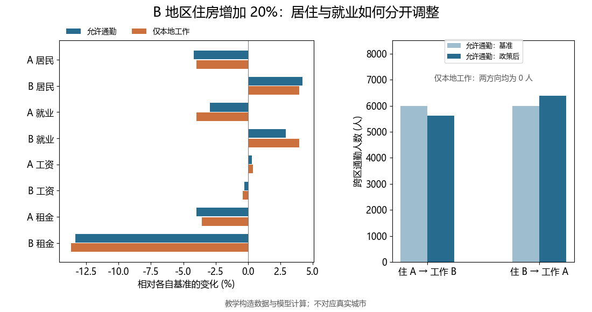
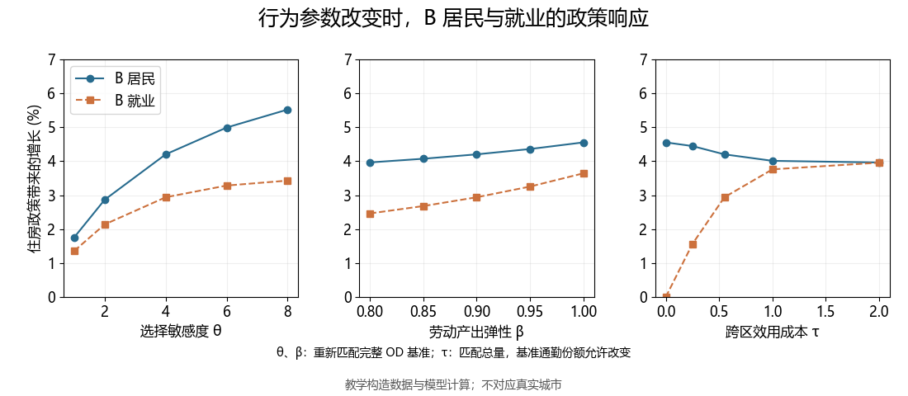

# 两地区 QSM：加入通勤

- **Title**: 两地区 QSM：加入通勤
- **Keywords**: QSM, 定量空间模型, 通勤, 引力方程, 空间均衡, 住房供给

P04 中，工人住在哪里，就在哪里工作。因此，B 地区多建住房以后，B 的居民数和就业数总是同增同减。真实城市并不如此。有人住在郊区，到中心城区工作；也有人因房租下降搬到一个地区，却没有改变工作地点。

这一区别会改变我们对住房政策的理解。B 地区增加住房以后，迁入 B 的居民可以在 B 工作，也可以每天前往 A。住房政策的直接作用是改变居住地选择；就业、工资和通勤流量还要通过新的均衡共同决定。

本文在 P04 的两地区框架中加入通勤。我们仍考察 B 地区有效住房服务存量增加 20% 的政策，但把每个工人的选择改为「住在何处、在哪里工作」的四种组合。新模型会分别计算居民数、就业数和双向通勤人数。文中的教学数据及参数均由本项目构造，不对应任何实际城市；下文政策数值由本地程序实际求解，并通过基准复原、市场出清与共同冲击等核验。

[toc]

## 1. 居民数与就业数为什么要分开

设城市只有 A、B 两个地区。P04 中，B 的劳动人口从 4 万增加到 4.2 万，可以同时理解为 B 的居民增加和 B 的就业增加。引入通勤后，这种写法不再成立。

令 $M_{ij}$ 表示住在地区 $i$、工作在地区 $j$ 的工人数。四个单元构成一个居住地—工作地通勤表：

| 居住地 \ 工作地 | A | B | 居住地合计 |
|---|---:|---:|---:|
| A | $M_{AA}$ | $M_{AB}$ | $R_{A}$ |
| B | $M_{BA}$ | $M_{BB}$ | $R_{B}$ |
| 就业地合计 | $E_{A}$ | $E_{B}$ | $N$ |

本文的居民数指按居住地统计的模型工人数，不包含儿童、退休人员等全部常住人口。其中，$R_{i}$ 是地区 $i$ 的居民数，$E_{j}$ 是地区 $j$ 的就业数，满足：

$$
R_{i}=\sum_{j}M_{ij},\qquad E_{j}=\sum_{i}M_{ij},\qquad \sum_{i,j}M_{ij}=N.
$$

例如，$M_{BA}$ 是住在 B、工作在 A 的人数。它增加时，B 的住房需求增加，A 的劳动投入增加。两种调整发生在不同地区，因此房租和工资也由不同的总量决定。

这一写法是后文所有机制的基础：**工资由就业地的就业数决定，房租由居住地居民的住房需求决定。**

## 2. 四种选择如何形成通勤引力

每个工人选择一个居住地 $i$ 和工作地 $j$。仍设普通商品价格为 1，住房支出份额为 $\alpha$，居住地 $i$ 的单位房租为 $r_{i}$，工作地 $j$ 的工资为 $w_{j}$。工人的效用与预算约束为：

$$
U_{nij}=\ln B_{i}+(1-\alpha)\ln c+\alpha\ln h-\tau_{ij}+\varepsilon_{nij},
\qquad c+r_{i}h=w_{j}.
$$

$B_{i}$ 是居住地便利度，$\tau_{ij}$ 是从 $i$ 到 $j$ 的广义通勤成本，$\varepsilon_{nij}$ 是工人 $n$ 对这一居住地—工作地组合的个体偏好。本文将 $\tau_{ij}$ 解释为以效用单位表示的通勤时间、拥挤和不便损失，而不把它从工资收入中扣除。因此，通勤成本影响选择和工人福利，但本教学特例不单列交通部门收入、燃油支出或道路建设成本。

令 $\tau_{AA}=\tau_{BB}=0$，并在两地区教学基准中设 $\tau_{AB}=\tau_{BA}=\tau>0$。在实际研究中，通勤时间、距离和票价可能具有方向差异，应据数据设置 $\tau_{ij}$。

给定居住地和工作地后，最优住房需求仍为 $h=\alpha w_{j}/r_{i}$。代回效用，得到组合 $(i,j)$ 的系统部分：

$$
V_{ij}=\ln B_{i}+\ln w_{j}-\alpha\ln r_{i}-\tau_{ij}+C_{\alpha},
$$

$$
C_{\alpha}=(1-\alpha)\ln(1-\alpha)+\alpha\ln\alpha.
$$

若 $\varepsilon_{nij}$ 独立同分布并服从尺度为 $1/\theta$ 的 I 型极值分布，则四种组合的预期份额为：

$$
p_{ij}=\frac{\exp\{\theta(\ln B_{i}+\ln w_{j}-\alpha\ln r_{i}-\tau_{ij})\}}
{\sum_{k\in\{A,B\}}\sum_{\ell\in\{A,B\}}\exp\{\theta(\ln B_{k}+\ln w_{\ell}-\alpha\ln r_{k}-\tau_{k\ell})\}},
\qquad M_{ij}=Np_{ij}.
$$

这里的 $\theta>0$ 衡量工人对系统效用差异的敏感程度。$\theta$ 越大，相同的工资、房租或通勤成本变化带来更大的空间重新配置。

固定居住地 $i$ 后，选择工作地的条件概率为：

$$
\Pr(j\mid i)=\frac{M_{ij}}{R_{i}}
=\frac{\exp\{\theta(\ln w_{j}-\tau_{ij})\}}
{\sum_{\ell\in\{A,B\}}\exp\{\theta(\ln w_{\ell}-\tau_{i\ell})\}}.
$$

这就是本篇的通勤引力关系：目的地工资较高会吸引工人，通勤成本较高会减少通勤流量。更完整的城市模型还会引入多个街区、不同类型工人和工作岗位；Ahlfeldt 等 ([2015](https://doi.org/10.3982/ECTA10876)) 利用通勤决策中的随机冲击得到可估计的通勤引力方程。本文只保留两地区和同质工人，以便看清均衡反馈。

## 3. 工资和房租分别由什么决定

企业在工作地 $j$ 使用劳动和固定的非劳动要素生产普通商品。将固定要素吸收进 $Z_{j}$，生产函数与竞争性工资为：

$$
Y_{j}=Z_{j}E_{j}^{\beta},\qquad
w_{j}=\beta Z_{j}E_{j}^{\beta-1},\qquad 0<\beta<1.
$$

这里的劳动投入是就业人数 $E_{j}$。在生产率与固定要素不变时，A 地区就业总量增加会降低其劳动边际产出和工资。仅改变居住地、保持工作地不变，不会直接改变工作地的劳动投入。例如，一个原本住 A、在 A 工作的工人搬到 B 后仍在 A 工作，A 的就业数并未因此增加。

住房服务固定在居住地。由于住在 $i$、工作在 $j$ 的工人将工资中的 $\alpha$ 比例用于住房，地区 $i$ 的住房市场出清条件为：

$$
r_{i}H_{i}=\alpha\sum_{j\in\{A,B\}}w_{j}M_{ij}.
$$

$H_{i}$ 是地区 $i$ 的有效住房服务存量。B 地区住房扩建会直接提高 $H_{B}$；它通过降低 B 的房租吸引居民，但迁入者的工资取决于他们在哪里工作。

该设定沿用 P04 的收入归属：工人只取得工资收入，住房和固定生产要素由区外所有者持有。因为通勤成本在本篇中是时间和便利度损失，工人消费、房租收入与生产收入的核算仍可闭合。若研究问题涉及地铁票价、拥堵收费或建设成本，需要显式加入交通服务供给和政府预算，不能将本篇的福利变化直接解释为交通项目的净社会收益。

## 4. 一份可校准的教学基准

为了比较 P05 与其受限通勤版本，P05 使用对称的教学基准。P04 原文采用另一组不对称数据，其结果不能直接作为本篇的对照组。设总工人数为 12 万，两地各有 6 万居民和 6 万就业岗位；每个地区的月工资为 9,600 元、单位住房月租金为 120 元/平方米。住房支出份额设为 $\alpha=0.25$，劳动产出弹性设为 $\beta=0.90$。

基准通勤表设为：

| 居住地 \ 工作地 | A | B | 居住地合计 |
|---|---:|---:|---:|
| A | 54,000 | 6,000 | 60,000 |
| B | 6,000 | 54,000 | 60,000 |
| 就业地合计 | 60,000 | 60,000 | 120,000 |

因此，两地各有 10% 的居民跨区通勤，净通勤流量为零。这个对称设计并非现实城市事实，而是为了让「允许通勤」和「居住地必须等于工作地」两个模型拥有相同的居民数、就业数、工资和房租基准，从而清楚比较住房冲击的传导差异。

### 4.1 在模拟选择任务上估计参数

程序按 [model.md](model.md) 的完整规则生成 20,000 个独立的四选项任务 (共 80,000 行)，种子为 20261005。工资、租金和跨区通勤强度独立变化；固定住房份额后估计 $\theta$ 和 $\theta\tau$，再恢复 $\tau$。

| 参数 | 模拟真值 | 估计值 | IID 标准误 |
|---|---:|---:|---:|
| $\theta$ | 4.000000 | 3.907169 | 0.064449 |
| $\kappa=\theta\tau$ | 2.197225 | 2.178161 | 0.024721 |
| $\tau$ | 0.549306 | 0.557478 | 0.011073 |

这些标准误仅针对独立模拟任务，不能解释为真实政策预测的不确定性。通勤成本标准误用 Delta 法并保留两个估计系数的协方差。主均衡仍使用教学真值，模拟估计结果只用于检验估计程序及附加敏感性演示。真实应用需要处理工资、租金的内生性及遗漏区位特征，AI 编写代码不能代替这些判断。

估计时使用 $V_{nij}=\theta(\ln w_{nj}-\alpha\ln r_{ni})-\kappa d_{nij}$，其中 $d_{nij}$ 为连续通勤强度 `commute_multiplier`，本地取 0，跨区在不同任务中变化。二元变量 `commute_indicator` 只用于标记是否跨区，不能替代这个连续变量。通勤参数以效用单位度量，不能直接读成分钟或元。

### 4.2 用教学真值反演基准

教学程序设 $\theta=4$。由 $M_{AB}/M_{AA}=1/9$ 可反演对称通勤成本：

$$
\tau=-\frac{1}{\theta}\ln\left(\frac{M_{AB}}{M_{AA}}\right)=\frac{\ln 9}{4}.
$$

取 $B_{A}=B_{B}=1$。给定基准通勤表、工资和房租，住房存量与生产率可由：

$$
H_{i}=\frac{\alpha\sum_{j}w_{j}^{0}M_{ij}^{0}}{r_{i}^{0}},
\qquad
Z_{j}=\frac{w_{j}^{0}(E_{j}^{0})^{1-\beta}}{\beta}
$$

反演。两地在此教学基准下均有 $H_{i}=120$ 万平方米。$H_{i}$ 和 $Z_{j}$ 是与模型条件相对应的有效量；基准拟合不构成对模型的外部验证。

真实研究至少需要四类数据：

| 对象 | 需要的口径 | 典型来源或处理 |
|---|---|---|
| 通勤流量 $M_{ij}$ | 同一时点、同一就业人群的居住地—工作地交叉表 | 人口普查通勤表、交通调查、带住址和工作地的调查或行政数据 |
| 居民数 $R_{i}$ 与就业数 $E_{j}$ | 分别按居住地和工作地统计 | 行合计与列合计须能与通勤表核对 |
| 工资 $w_{j}$ 与房租 $r_{i}$ | 工资按工作地，房租按居住地；统一人群、时间单位和住房质量 | 劳动调查、工资统计、租赁合同或住房调查 |
| 通勤成本 $\tau_{ij}$ | 距离、时间、票价、换乘或拥挤等信息 | 路网、手机轨迹、地图 API、交通调查；需说明如何映射到效用单位 |

两行人口与工资数据不足以识别通勤成本。若使用多项选择模型估计 $\theta$ 和 $\tau$，需要观察工人的备选居住地—工作地组合，或者采用具有明确属性变化的选择实验。仅将基准通勤表拟合得很好，不能替代这一识别工作。

## 5. B 增加 20% 住房后，哪些量会改变

政策设为：

$$
\widehat H_{A}=1,\qquad \widehat H_{B}=1.20.
$$

便利度 $B_{i}$、生产率 $Z_{j}$、通勤成本 $\tau_{ij}$、总工人数及行为参数在反事实中保持不变。程序必须同时求出居民数和就业数，使四种组合的选择概率、工资条件和两个住房市场条件全部成立。

与 P04 相比，P05 至少要多回答三个问题：

- B 新增居民中，有多少留在 B 工作，有多少到 A 工作；
- B 的居民增长与就业增长是否相同，以及两者为什么不同；
- A 的工资变化来自当地就业变化，还是仅来自居民迁出。

结果表把居住地与工作地分开报告。以下均为构造教学基准上的均衡计算，人口保留两位小数便于核对；它表示模型期望人数。

| 指标 | A：基准 → 政策后 | B：基准 → 政策后 | 解释 |
|---|---:|---:|---|
| 居民数 $R_{i}$ | 60,000 → 57,478.31 | 60,000 → 62,521.69 | 决定当地住房需求 |
| 就业数 $E_{i}$ | 60,000 → 58,236.74 | 60,000 → 61,763.26 | 决定当地工资 |
| 月工资 $w_{i}$ | 9,600 → 9,628.68 | 9,600 → 9,572.23 | 按工作地统计 |
| 单位月租金 $r_{i}$ | 120 → 115.23 | 120 → 103.96 | 按居住地统计 |
| 跨区通勤 $M_{AB}$ | 6,000 → 5,627.32 | — | 住 A、工作 B |
| 跨区通勤 $M_{BA}$ | 6,000 → 6,385.75 | — | 住 B、工作 A |

同一组外生住房供给变化还应在「限制跨区通勤」的基准模型中重新求解。该模型只允许 $M_{AA}$ 和 $M_{BB}$，因此居民数与就业数在每个地区相等。由于两种设定使用相同的对称总量基准，政策结果之间的差异可用来说明通勤渠道如何改变住房扩建的传导。




B 地区居民比基准增加 2,521.69 人，就业增加 1,763.26 人。按通勤格子分解，住 B 且在 B 工作的人数增加 2,135.94，住 B 到 A 工作的人数增加 385.75；两者相加等于 B 居民增量。这是均衡格子人数的变化，模型未跟踪具体工人的搬迁轨迹。

B 居民增长 4.2028%，就业增长 2.9388%。净向 A 通勤为 758.43 人，恰好等于 B 的居民数减就业数。A 就业减少，使其工资提高；B 工资略降，单位租金由 120 元降至 103.96 元。

| B 地区指标 | 允许通勤 | 仅本地工作 |
|---|---:|---:|
| 政策后居民数 (人) | 62,521.69 | 62,376.86 |
| 政策后就业数 (人) | 61,763.26 | 62,376.86 |
| 政策后月工资 (元/工人) | 9,572.23 | 9,562.78 |
| 政策后单位月租金 (元/平方米) | 103.96 | 103.56 |
| 工人事前福利指数增幅 (%) | 2.3540 | 2.3514 |

表中的福利分别相对于各模型自己的基准。两模型的选择集合不同，不能把福利水平之差解释为同一项政策收益；这里也没有估计真实城市通勤政策效应。受限模型单独校准，对角掩码使跨区流量严格为零。

这里需要避免两种误读。B 的居民增加并不自动说明 B 的岗位增加；全体工人的事前福利上升也不等于交通建设或住房建设的净社会收益。后者还需要建设成本、区外所有者收益和可能的财政收支。

## 6. 求解、福利与应检查的条件

P04 只有一个独立的人口份额。P05 至少有两个独立总量：B 的居民份额与 B 的就业份额。可以令：

$$
x=\ln\left(\frac{R_{B}}{R_{A}}\right),\qquad
y=\ln\left(\frac{E_{B}}{E_{A}}\right).
$$

给定 $(x,y)$，程序先恢复 $R_{i}$、$E_{j}$，再按生产函数计算工资、按住房市场计算房租、由四种选择概率计算 $M_{ij}$。求解器调整 $(x,y)$，直至模型计算出的居民和就业边际份额同时等于候选份额。P05 不声称这个两变量特例具有一般的解析解或普遍唯一性，应报告数值收敛情况，并用经济条件检查结果。

工人的事前福利指数可以写为：

$$
W=\left[
\sum_{i\in\{A,B\}}\sum_{j\in\{A,B\}}
\left(\frac{B_{i}w_{j}}{r_{i}^{\alpha}}e^{-\tau_{ij}}\right)^{\theta}
\right]^{1/\theta}.
$$

在偏好分布和参数不变时，$\ln W$ 对应期望最大效用，差一个政策前后相同的常数。应报告 $W^{1}/W^{0}-1$，并明确它是政策实施前工人在可选择四种组合时的福利变化。

配套程序至少应通过下列检查：

- 精确复原教学基准的 $M_{ij}$、$R_{i}$、$E_{j}$、工资和房租；
- 验证 $R_{i}=\sum_{j}M_{ij}$、$E_{j}=\sum_{i}M_{ij}$ 与总人口约束；
- 验证工资等于劳动边际产出，住房市场在两地出清；
- 验证零冲击回到基准；
- 令两地住房同时增加 20%，检查所有选择份额和工资保持不变、两地租金均除以 1.20、福利指数同乘 $1.20^{\alpha}$；
- 提高跨区通勤成本至足够大时，检查交叉通勤流量趋近于零，结果趋近于「居住地等于工作地」的受限模型；
- 令两地生产率同时增加 10%，检查选择份额不变、工资与租金同乘以 1.10，福利指数同乘以 $1.10^{1-\alpha}$；
- 将 A、B 的全部基本面和住房冲击同时互换，检查结果按地区标签镜像变化。


### 6.1 运行与求解

在仓库根目录执行：

```text
python -X utf8 -m pip install -r articles/p05-commuting-qsm/requirements.txt
python -X utf8 articles/p05-commuting-qsm/code/qsm_commuting_demo.py --output runs/p05-my-run
```

本程序使用 Python 3.11.14 测试。若缺少中文字体，可加 `--no-figures` 先核验数值；输出目录已存在且非空时，请更换目录名，程序不会覆盖旧结果。本次实际输出存于 `runs/p05-final-run/`，已验收的对照结果在 [results/reference](results/reference/)。

给定候选居民数与就业数后，先由工作地工资计算条件概率，再由候选居民数乘以条件平均工资计算租金；随后用联合概率重新核对两个边际。这个步骤补足二维求解的计算顺序，没有改变住房市场方程。

### 6.2 核验与敏感性

<details>
<summary>查看数值核验与求解器说明</summary>

本次 484 项检查通过，逐项误差、阈值及环境版本见 [verification.json](results/reference/verification.json)，五个初值及备用求解器诊断见 [solver-diagnostics.json](results/reference/solver-diagnostics.json)。对称解附近 `hybr` 曾返回无进展，程序保留状态后使用相同方程的 `lm` 备用算法，并重新检查市场出清。

</details>



图中展示 B 居民与就业的政策增幅。改变选择敏感度时同步校准通勤成本，以保持完整 OD 基准；改变劳动产出弹性时重新反演生产率。单独改变通勤成本时只保持对称总量基准，允许基准通勤份额改变。每组政策均固定该组基本面，因此不能把跨组参数差异当成主住房政策本身的效应，也不能把曲线当成置信区间。

独立实现练习只需公开文章、模型、固定输入与 [实现提示词](prompts/01-implement.md)。请在新的目录和会话中实现，首次完成前不要读取参考代码，再按 [核验提示词](prompts/02-verify.md) 逐项检查。已完成独立会话试跑，固定输入一致，主结果与参考程序在 1e-8 的比较阈值内一致。公开数值核验文件随附件提供。

### 6.3 两个极端情形与练习

当通勤成本为 0、四种组合均可选时，联合选择概率可分解为居住地项与工作地项：

$$
p_{ij}=\frac{(B_{i}/r_{i}^{\alpha})^{\theta}}{\sum_{k}(B_{k}/r_{k}^{\alpha})^{\theta}}
\frac{w_{j}^{\theta}}{\sum_{\ell}w_{\ell}^{\theta}}.
$$

在本模型的固定生产基本面与总工人数下，住房扩建改变居住分布，工作地边际份额由工资与生产端条件共同决定，不依赖住房分布。因此，无通勤成本情景中的 B 居民增加，而就业数保持不变。这依赖本文的可分离偏好、同质工人和没有集聚外部性的设定，不能直接推广到所有城市模型。

当跨区通勤成本很高时，跨区份额趋近于 0，居民数与就业数逐渐重合，住房政策结果接近只允许本地工作的模型。这正好解释敏感性图中居民和就业两条曲线为何靠拢。比较这两个端点，比只观察一条曲线的斜率更容易理解通勤渠道。

练习一：把通勤成本设为 0，先判断 B 居民和就业是否都会增加，再运行验证。练习二：保持主模型基本面，只把 B 住房增加 10%，检查居民增量、就业增量和净通勤是否满足记账恒等式。练习三：把跨区成本提高到 20，与受限模型比较，说明为什么不能用严格为 0 的流量作为相对误差分母。在线 Notebook 提供可运行的答案脚手架。

常见错误包括把 M 的行列互换、用居民数计算工资、把通勤效用成本从工资扣除、用跨区指示变量替代连续通勤强度，以及在政策冲击后重新反演基本面。遇到这些错误时应回到方程与输入口径，不通过调参使结果符合预期。

## 7. 从两地区通勤模型走向城市内部 QSM

P05 的新增内容只有一个：居住地和工作地可以不同。它已经能说明住房供给冲击会沿着通勤流量传导，却没有加入企业集聚、居民便利度外部性、异质工人、交通建设成本或多个街区。

下一篇可以将政策从住房供给改为通勤成本，考察新地铁或道路改善如何改变居住、就业和房租。再往后，若让生产率随就业密度变化，就可以讨论交通改善和住房供给为何可能改变就业中心的位置，并与柏林墙研究中更完整的城市空间机制衔接。

## 8. 借助 Agent 实现、校准与核验

运行本章 Notebook 可以熟悉结果。若想练习把经济模型转成程序，可以另开一个 Agent 会话，只提供模型说明和固定输入，让它完成代码实现，再检查每一步是否对应经济方程。提示词需要说清变量口径、收入归属、政策中固定什么，以及如何验收。

### 8.1 准备一个独立练习目录

下载并解压[Agent 练习包](downloads/commuting-agent-inputs.zip)。其中只有模型说明、固定教学数据、提示词和许可文件，不含参考代码、Notebook 或政策结果。将新会话的工作目录设为解压目录。也可以从完整仓库复制同名文件，目录如下：

```text
commuting-agent-practice/
  model.md
  data/
    README.md
    teaching-baseline.csv
    synthetic-joint-choice-tasks.csv
  prompts/
    01-implement.md
    03-estimate-calibrate.md
    02-verify.md
```

固定 CSV 用于复现同一组教学任务，首次实现不重新抽样。先告诉 Agent 可用的 Python 环境；若它无法运行代码，应保留未验证状态，不能将生成了一段代码写成已完成数值计算。模型说明中的基准与真值是输入，政策后的均衡结果需要程序求出。

### 8.2 从零生成实现

把下面的提示词交给新会话。先检查它列出的方程与函数对应关系，再看实际输出。[下载提示词](prompts/01-implement.md)。

```text
请在当前练习目录独立用 Python 实现两地区通勤 QSM。
先阅读 model.md、data/README.md 和 data/ 下两份固定 CSV。
只使用这些输入，不读取参考程序、Notebook 或参考结果。
先检查运行环境并记录输入 SHA256，不安装或修改全局环境。

请按以下步骤编写并实际运行程序：
1. 说明 M 的行是居住地、列是工作地，R 为行和、E 为列和。
   列出选择、生产、工资、住房和福利方程及函数对应关系。
2. 用固定四选项样本估计 theta 与 kappa=theta*tau。
   使用连续变量 commute_multiplier，不以 commute_indicator 替代；
   保持 alpha 给定，计算信息矩阵 IID 标准误和含协方差的 Delta 法标准误。
   不重新生成样本，不把估计值自动代入主政策。
3. 主均衡使用 model.md 的教学真值。由基准流量和价格反演 H、Z，
   校准后先复原四格 OD、居民、就业、工资和租金。
4. 以 log(R_B/R_A)、log(E_B/E_A) 为未知量求均衡。
   由就业计算工资，再按条件工作地概率及居民收入计算候选租金。
   用联合概率重算流量，检验其边际和最终住房出清。
5. 只把 H_B 乘以 1.20，保持本组其他基本面与参数不变。
   另用对角选择掩码建立仅本地工作模型，独立校准其基准。
6. 完成 model.md 的敏感性网格、共同冲击、标签互换、高成本极限
   和至少五个初值检查。每次改变参数后按约定重新校准，
   每次政策计算中固定该组基本面；不能为得到预期结果临时调参。

代码写入 code/，结果写入新的 results/ 子目录，不覆盖已有成果。
至少导出估计与标准误、校准参数、均衡表、四格流量、敏感性表、
逐项误差及阈值、求解器诊断、实际运行命令与环境版本。
禁止硬编码政策答案。失败时保存错误和残差，不只报告 success。
所有数据与结果均为教学构造；福利是工人事前指数，不含建设成本。
首次实现完成并保存记录后，才能另行接收参考结果作对照。
```

### 8.3 单独检查估计与校准

读结果时，先看参数表能否区分教学真值、模拟估计值和反演基本面，再看基准误差表。若这一步混淆，求解器正常退出也不能说明政策计算可靠。这段提示词适合已有程序后的复查。[下载提示词](prompts/03-estimate-calibrate.md)。

```text
请检查当前实现中的参数估计和基准校准，以 model.md 为准。
读取固定 CSV 并报告哈希；不要替换数据、真值或经济设定。

估计部分：
- 每个 choice_set_id 有 AA、AB、BA、BB 四项且恰好一项 chosen=1。
- 使用 V=theta*(log_wage-alpha*log_rent)-kappa*commute_multiplier；
  固定 alpha，检查 theta、kappa 的可识别秩、得分、优化状态和信息矩阵。
- 报告 theta、kappa、tau=kappa/theta、IID 标准误及 Delta 法标准误；
  Delta 法必须保留 theta 与 kappa 的协方差。
- 检查估计量与真值之差是否落在本教学样本的 4 个标准误内，
  但不得把这次恢复诊断称为覆盖率实验或真实城市识别。

校准部分：
- 单列教学真值、模拟估计值、反演基本面，不混用三种来源。
- 主均衡使用教学真值。按住房出清反演 H，按工资边际产出反演 Z；
  基准复原四格 OD、R、E、w、r 的相对误差应不超过 1e-8。
- theta 网格同步设 tau=ln(9)/theta 以匹配完整 OD；beta 网格重算 Z；
  单独改变 tau 时固定 theta，只匹配对称总量并允许 OD 改变。
  联合估计参数情景同样不能强行匹配原 OD。
- 在任一政策情景内固定已经校准的基本面，不再反演它们。

将估计诊断、校准复原误差和发现的问题分别导出。
如果需要修改代码，说明对应的方程或数据口径，修改后实际复测。
不通过调参、换样本或放宽阈值让检查通过。
```

### 8.4 用经济条件验收

可以把程序与输出交给另一个会话，让它依据模型方程重新核算。不同会话也可能犯相同错误，因此最终仍须查看误差、阈值、零冲击、极端情形和初值比较。[下载核验提示词](prompts/02-verify.md)。

```text
请独立审查并重新运行当前练习目录的程序，以 model.md 为准。
不要修改模型、输入数据、真值或验收阈值。
请直接依据方程重算下列条件，不只调用原程序自己的验证函数：

1. 基准四格 OD、R、E、w、r 的相对误差不超过 1e-8。
2. 总工人数、M 的行列边际、联合选择概率、工资边际产出、
   住房出清及两地区合计的普通商品资源核算成立。
   住房支出使用 alpha*sum_j(w_j*M_ij)，工资使用工作地就业 E_j。
3. 零冲击返回基准；共同住房、共同生产率冲击满足 model.md 的性质；
   A/B 标签互换后结果镜像；至少五个初值的均衡解一致。
4. 对角掩码模型的跨区流量严格为 0，并符合受限解析式；
   tau=20 时跨区份额低于 1e-12，政策结果接近受限模型。
   免费通勤时检验联合概率的可分离性和住房政策下就业不变。
5. 检查全部敏感性情景及估计的秩、得分、信息矩阵、Delta 法协方差。
   一般相对误差或份额误差阈值为 1e-8；零流量不能用零作分母。
6. 图例必须与可见数据系列对应。严格为零的受限通勤注明为 0，
   不伪造可见柱形。福利不得写成扣除建设成本后的净社会收益。

保存每项误差、阈值、通过状态、实际命令和运行环境。
若求解器报告失败，保留诊断，检查残差与经济条件；
更换算法时求解同一方程，不更换模型。
有参考结果时，在首次独立实现结束后另做对照并报告差异。
区分自己重新计算的检查与引用的历史结果，不冒充新的独立试跑。
```

验收时重点看四类文件：参数表中的估计值与标准误，基准表中的逐项误差，政策表中居民与就业的差别，以及核验文件中的失败项。参数恢复只是在已知生成机制下检查程序；真实工资、租金与通勤成本的内生性仍需研究设计处理。

此前版本的实现提示词已在独立新会话中实际试跑，并与参考实现进行数值对照。本节进一步细化了估计、校准和核验步骤；本轮核对了提示词与模型约定的一致性，没有再次进行新会话盲写测试。运行本章 Notebook、按提示词独立编程、用真实数据识别模型参数，是三项不同的工作。Agent 可以辅助代码和排错，经济设定、识别判断与结果解释仍需研究者负责。

## 9. 参考资料

1. Ahlfeldt, G. M., Redding, S. J., Sturm, D. M., & Wolf, N. (**2015**). The economics of density: Evidence from the Berlin Wall. *Econometrica*, 83(6), 2127–2189. [Link](https://doi.org/10.3982/ECTA10876), [PDF](https://swh.princeton.edu/~reddings/pubpapers/Berlin-Ecta-10876.pdf), [Google](<https://scholar.google.com/scholar?q=The+Economics+of+Density+Evidence+from+the+Berlin+Wall>).
2. Davis, M. A., & Ortalo-Magné, F. (**2011**). Household expenditures, wages, rents. *Review of Economic Dynamics*, 14(2), 248–261. [Link](https://doi.org/10.1016/j.red.2009.12.003), [PDF](https://doi.org/10.1016/j.red.2009.12.003), [Google](<https://scholar.google.com/scholar?q=Household+Expenditures+Wages+Rents>).
3. Redding, S. J. (**2023**). Quantitative urban models: From theory to data. *Journal of Economic Perspectives*, 37(2), 75–98. [Link](https://doi.org/10.1257/jep.37.2.75), [PDF](https://www.princeton.edu/~reddings/pubpapers/JEP-Urban-2023.pdf), [Google](<https://scholar.google.com/scholar?q=Quantitative+Urban+Models+From+Theory+to+Data>).

文献核查日期 (retrieved_date)：2026-10-05。Davis and Ortalo-Magné 的 PDF 字段使用 DOI 入口兜底，不表示已获取免费全文。

配套材料：[模型与模拟规则](model.md)、[本地运行说明](README.md)、[独立实现提示词](prompts/01-implement.md)、[核验提示词](prompts/02-verify.md)。本文件为正式正文；网站章节与可独立运行的 Notebook 在通勤扩展入口提供。所有结果均为教学模型计算。
